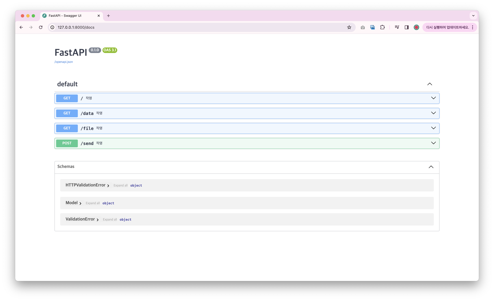
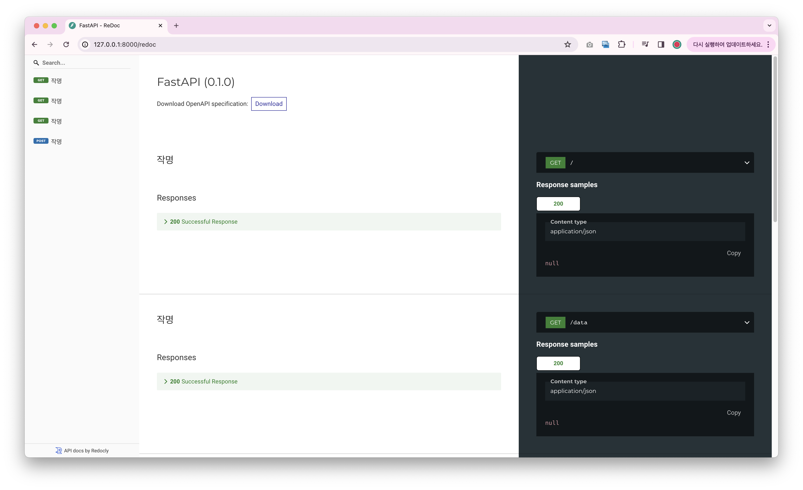

## FastAPI 프레임워크
### 개념
- django보다 2배 빠르고, go보다 4배 빠른 프레임워크
- 특정코드가 오래 걸리면 일단 다른 코드 먼저 처리하는 비동기 처리가 가능하다.
- 가능한 기능
  - GET, POST 요청받기
  - DB 입출력
  - 회원인증
  - 데이터 validation
  - 웹소켓
  - async/await
  - type 넣기
  - API 문서 자동 생성
- 웹 개발 프레임워크라고 보다는 API 툴인 느낌이다.

### 실행 방법
```
pip install fastapi
pip install uvicorn
uvicorn main:app --reload
```

### API 문서 확인하기
1. 127.0.0.1:8000/docs

2. 127.0.0.1:8000/redoc

---
**해당 레포지토리의 다음의 유튜브 강의를 통해 학습한 내용을 기반으로 합니다.**

(https://www.youtube.com/watch?v=5A67mQ2Pt9s)